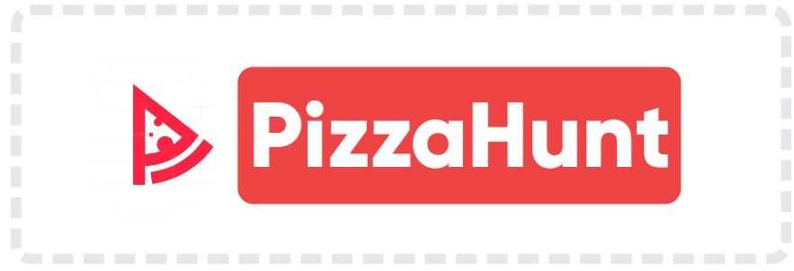
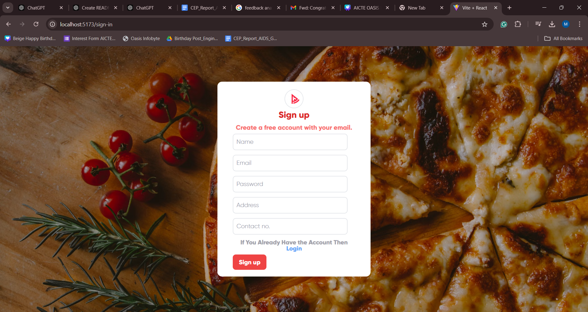
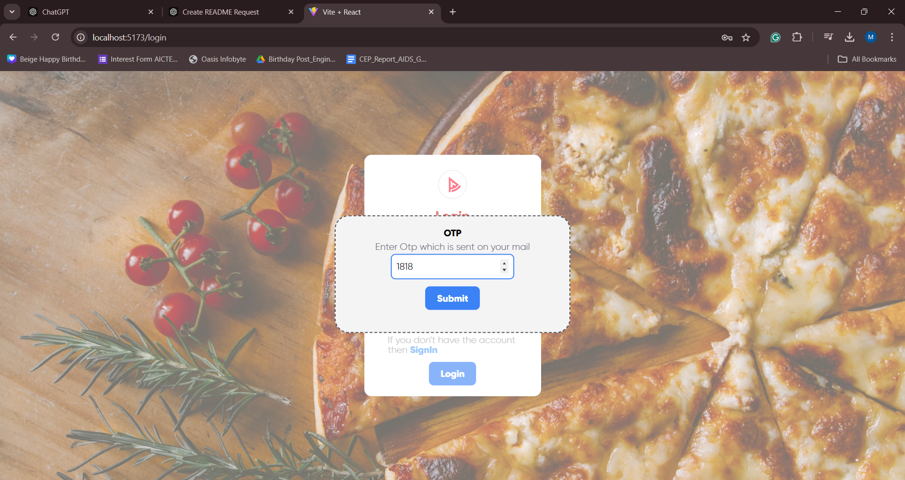
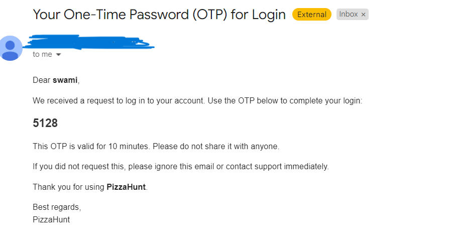
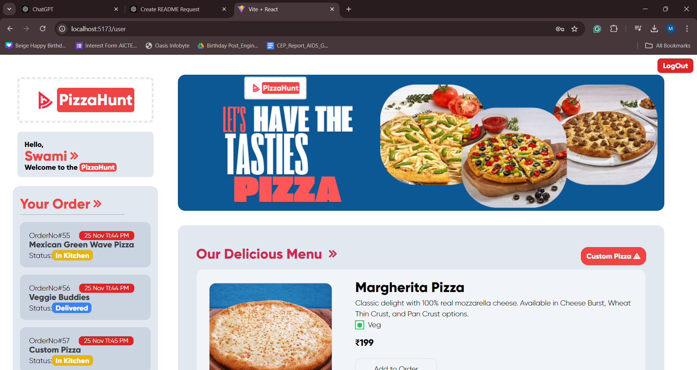
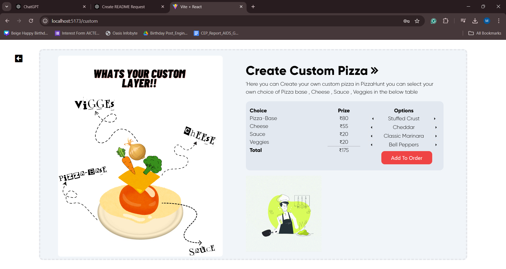
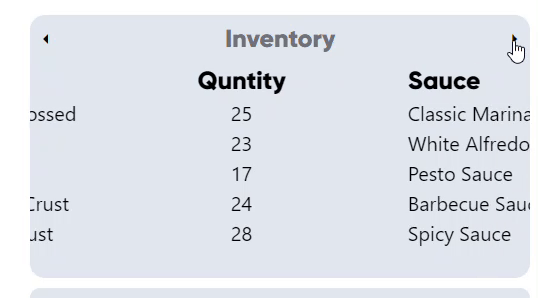
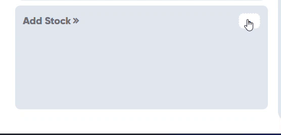
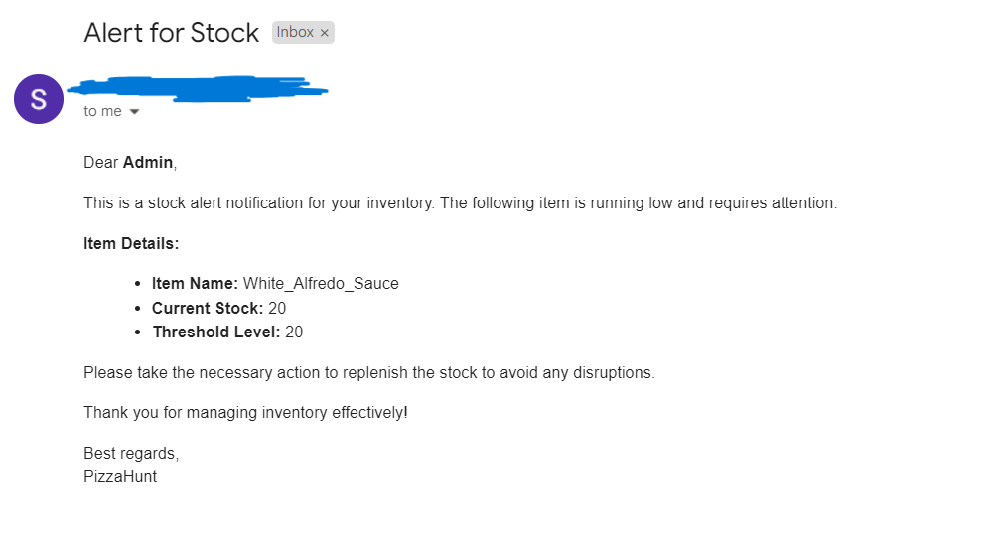

# 🍕 PizzaHunt

**PizzaHunt** is a full-stack web application that lets users create and order custom pizzas while providing an admin dashboard for managing inventory and order status. Developed as part of an internship with **OASIS Infobyte**, this project demonstrates a seamless user experience and efficient backend management.


---

## 🎯 Project Overview

### User Features:
1. **Authentication System:**
   - User registration and login.
   - 
 

   - Email verification during sign-up.
   - 
      
     
       
   - Forgot Password functionality for secure recovery.
     
2.**User Interface:**

   


3. **Interactive Pizza Creation Flow:**
   - Choose a pizza base from 5 options.
   - Select a sauce from 5 available choices.
   - Pick your preferred cheese.
   - Add veggies and customize with multiple options.
   

4. **Order Placement:**
   - Integrated Razorpay for payment processing in test mode.
   - Simulated checkout system to place and confirm orders.

5. **Order Tracking:**
   - Real-time order status updates, including:
     - Order Received.
     - In the Kitchen.
     - Sent for Delivery.

---

### Admin Features:
1. **Inventory Management:**
   - Track available stocks of pizza bases, sauces, cheese, veggies, and meats.
   - Automated stock updates after order placement.
    
  


2. **Stock Monitoring:**
   - Email notifications triggered when stock levels drop below threshold (e.g., pizza base < 20).
     
        

3. **Order Control:**
   - View and manage orders.
   - Update order statuses with changes reflected in the user dashboard.

---

## 🛠️ Tech Stack

- **Frontend:** React.js
- **Backend:** Node.js, Express.js
- **Database:** MongoDB
- **Payment Integration:** Razorpay (Test Mode)

---

## 🚀 Getting Started

### Prerequisites
- Node.js installed on your system.
- MongoDB set up locally or via a cloud service (e.g., MongoDB Atlas).

### Installation Steps
1. **Clone the Repository:**
   ```bash
   git clone https://github.com/yourusername/PizzaHunt.git
   cd PizzaHunt

